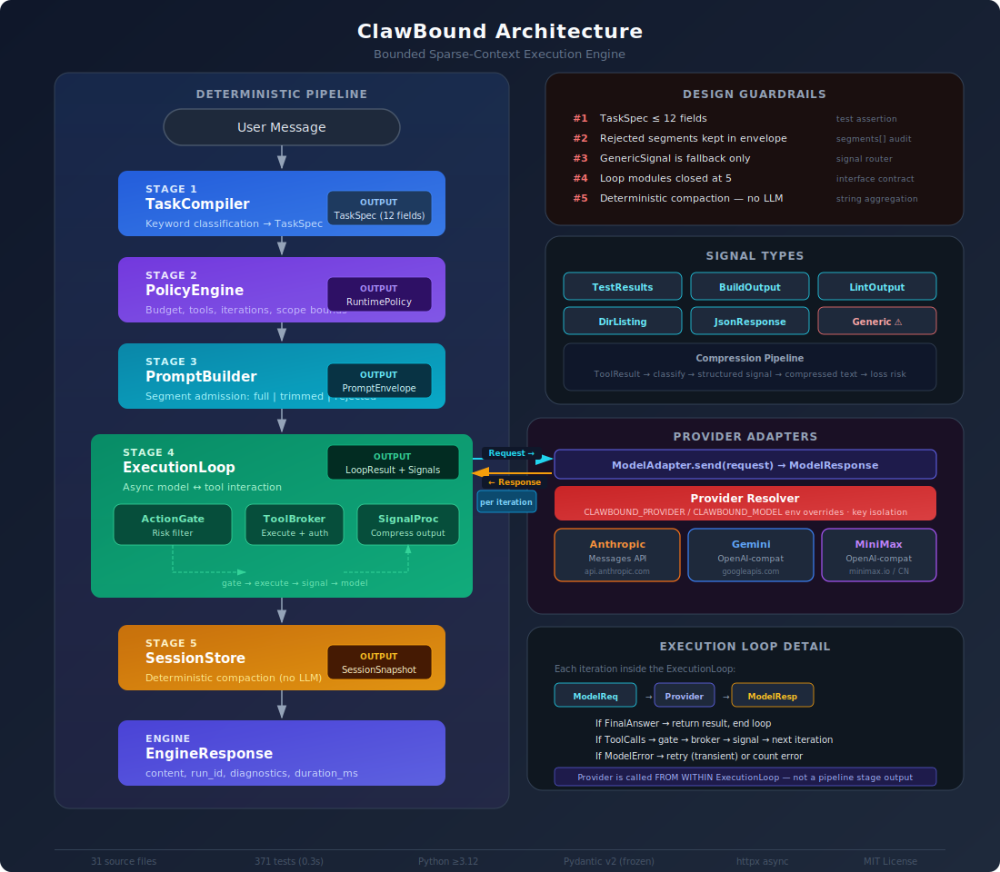
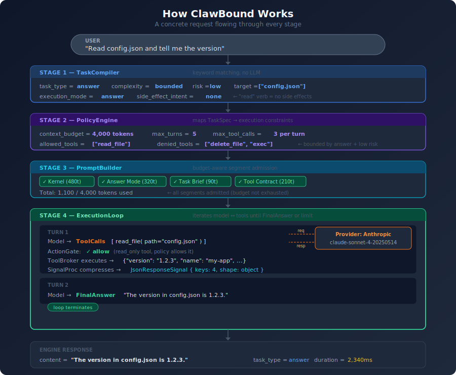

# ClawBound

**Bounded sparse-context execution engine for AI agents.**

ClawBound is a deterministic runtime pipeline that sits between user input and LLM providers. It classifies tasks, derives execution policies, builds budget-aware prompts, orchestrates tool-calling loops, compresses signals, and maintains multi-turn session state — all without requiring an LLM for its own decision-making.

```
pip install clawbound
```

---

## Architecture

<p align="center">
  
</p>

Every request flows through a **4-stage deterministic pipeline**. The Engine wraps this pipeline with session management (read history before, write turn after). SessionStore is a side-channel, not a pipeline stage.

| Stage | Module | What It Does |
|-------|--------|-------------|
| 1 | **TaskCompiler** | Classifies user input → `TaskSpec` (type, complexity, risk). Keyword matching, no LLM. |
| 2 | **PolicyEngine** | Derives execution constraints → `RuntimePolicy` (token budget, allowed tools, iteration limits). |
| 3 | **PromptBuilder** | Assembles system prompt from segments. Each segment is admitted, trimmed, or rejected by budget. |
| 4 | **ExecutionLoop** | Calls the LLM, handles tool calls (gate → broker → signal), iterates until `FinalAnswer` or limit. |
| — | **SessionStore** | Side-channel: reads conversation history before the pipeline, writes the new turn after. |

---

## How It Works

<p align="center">
  
</p>

The diagram above shows a real request flowing through every stage — with actual data at each step. This is what ClawBound does: it classifies the task, derives safe execution boundaries, builds a budget-aware prompt, then runs a tool-calling loop with the LLM provider.

### Provider Adapters

| Provider | Endpoint | Auth |
|----------|----------|------|
| **Anthropic** | Native Messages API (`api.anthropic.com`) | `ANTHROPIC_API_KEY` |
| **Google Gemini** | OpenAI-compatible (`generativelanguage.googleapis.com`) | `GEMINI_API_KEY` |
| **MiniMax** | OpenAI-compatible (`api.minimax.io` / `api.minimaxi.com` CN) | `MINIMAX_API_KEY` |

Providers are swappable at runtime: `CLAWBOUND_PROVIDER=google CLAWBOUND_MODEL=gemini-2.5-flash`

---

## Quick Start

### Programmatic API

```python
import asyncio
from clawbound import create_engine, EngineConfig, EngineRequest

async def main():
    engine = create_engine(EngineConfig(
        provider="anthropic",
        model="claude-sonnet-4-20250514",
        api_key="sk-ant-...",
    ))

    response = await engine.run(EngineRequest(message="What is 2+2?"))
    print(response.content)         # "4"
    print(response.diagnostics)     # task_type=answer, complexity=trivial, risk=low

asyncio.run(main())
```

### CLI

```bash
# Basic usage
clawbound --provider anthropic --model claude-sonnet-4-20250514 --message "Explain Python GIL"

# JSON output with full diagnostics
clawbound --provider anthropic --model claude-sonnet-4-20250514 --message "hello" --json

# With explicit API key
clawbound --provider google --model gemini-2.5-flash --api-key "AIza..." --message "hello"

# Multi-turn session
clawbound --provider anthropic --model claude-sonnet-4-20250514 --session-id s1 --message "Hello"
clawbound --provider anthropic --model claude-sonnet-4-20250514 --session-id s1 --message "What did I just say?"
```

### Multi-Turn Sessions

```python
from clawbound import create_engine, EngineConfig, EngineRequest

engine = create_engine(EngineConfig(provider="anthropic", model="claude-sonnet-4-20250514"))

# Turn 1
r1 = await engine.run(EngineRequest(message="My name is Alice", session_id="s1"))

# Turn 2 — engine automatically includes conversation history
r2 = await engine.run(EngineRequest(message="What's my name?", session_id="s1"))
print(r2.content)  # "Your name is Alice."

# Session management
snapshot = engine.get_session("s1")
print(len(snapshot.turns))  # 2

# Deterministic compaction (no LLM summarization)
engine.compact_session("s1", retain_turns=1)
```

### Tool Registration

```python
from clawbound import create_engine, EngineConfig, EngineRequest
from clawbound.contracts.types import ToolDefinition
from clawbound.orchestrator import ToolRegistration

async def read_file(args: dict) -> dict:
    path = args.get("path", "")
    content = open(path).read()
    return {"output": content}

engine = create_engine(EngineConfig(provider="anthropic", model="claude-sonnet-4-20250514"))

response = await engine.run(EngineRequest(
    message="Read the contents of config.json",
    tool_registrations=[
        ToolRegistration(
            definition=ToolDefinition(
                name="read_file",
                category="filesystem",
                risk_level="read_only",
                description="Read a file from disk",
            ),
            execute_fn=read_file,
        ),
    ],
))
```

### Testing with Deterministic Adapter

```python
from clawbound import create_test_engine
from clawbound.contracts.types import FinalAnswer

# Scripted responses — no API key needed
engine = create_test_engine([
    FinalAnswer(content="Hello! How can I help?"),
])

response = await engine.run(EngineRequest(message="Hi"))
assert response.content == "Hello! How can I help?"
assert response.termination == "final_answer"
```

---

## Core Concepts

### TaskSpec — What the user wants

The `TaskCompiler` classifies every input into a `TaskSpec` with 12 fields (guardrail #1):

```python
TaskSpec(
    task_id="...",
    trace_id="...",
    task_type="answer",           # answer | review | code_change | architecture | debug
    complexity="trivial",         # trivial | bounded | multi_step | ambiguous
    risk="low",                   # low | medium | high
    domain_specificity="generic", # generic | repo_specific | continuation_sensitive
    execution_mode="answer",      # answer | reviewer | executor | executor_then_reviewer | architect_like_plan
    output_kind="explanation",    # explanation | code_patch | review_comments | plan | diagnostic
    side_effect_intent="none",    # none | proposed | immediate
    target_artifacts=(),          # extracted file paths, URLs, PR/issue refs
    raw_input="What is 2+2?",
    decision_trace=DecisionTrace(...),  # full audit trail of classification decisions
)
```

Classification is deterministic — keyword matching, no LLM calls.

### RuntimePolicy — How to execute

The `PolicyEngine` maps `TaskSpec` → `RuntimePolicy`:

```python
RuntimePolicy(
    execution_mode="answer",
    context_budget=ContextBudget(
        always_on_max_tokens=4000,     # kernel + mode + task + context + tools
        retrieval_max_tokens=2000,     # RAG snippets
        host_injection_max_tokens=1000, # external injections
        ...
    ),
    tool_profile=ToolProfilePolicy(
        allowed_tools=("read_file",),
        denied_tools=("delete_file",),
        requires_review=False,
        ...
    ),
    iteration_policy=IterationPolicy(
        max_turns=5,
        max_tool_calls_per_turn=3,
        max_consecutive_errors=2,
        ...
    ),
    scope_bounds=ScopeBounds(...),
    approval_policy=ApprovalPolicy(...),
)
```

### PromptEnvelope — Budget-aware system prompt

The `PromptBuilder` creates structured segments and applies budget-aware admission:

| Segment | Owner | Budget Category | Admission |
|---------|-------|----------------|-----------|
| Kernel | runtime | always_on | Always admitted |
| Mode Instruction | runtime | always_on | Always admitted |
| Task Brief | task | always_on | Always admitted |
| Local Context | context | always_on | Budget-gated |
| Retrieved Snippets | context | retrieval | Budget-gated |
| Tool Contract | tool_contract | always_on | Always admitted |
| Host Injections | host_injection | host_injection | Budget-gated |

Each segment is either `admitted_full`, `admitted_trimmed` (content truncated to fit), or `rejected` (budget exhausted). **Rejected segments are kept in the envelope** for diagnostics (guardrail #2).

### SignalBundle — Compressed tool output

The `SignalProcessor` transforms raw tool output into structured signals:

| Output Kind | Signal Type | Example |
|-------------|-------------|---------|
| `test_results` | `TestResultsSignal` | Pass/fail counts, failure details with stack traces |
| `build_output` | `BuildOutputSignal` | Success/fail, error locations, warning counts |
| `lint_output` | `LintOutputSignal` | Violation counts, rule breakdown, fixable count |
| `directory_listing` | `DirectoryListingSignal` | File/dir counts, tree structure |
| `json_response` | `JsonResponseSignal` | Schema shape, key values, HTTP status |
| `*` (fallback) | `GenericSignal` | Line/char/token counts, head+tail compression |

Compression is deterministic — no LLM summarization. `GenericSignal` is the fallback only (guardrail #3).

### Session Compaction

The `SessionStore` uses deterministic compaction (guardrail #5):

```python
# After 10 turns, compact to keep only the last 3
engine.compact_session("s1", retain_turns=3)
# Dropped turns are summarized: tools used, success/error counts
# No LLM involved — pure string aggregation
```

Compaction summaries accumulate across multiple compactions, separated by `---`.

---

## Design Guardrails

| # | Rule | Enforcement |
|---|------|------------|
| 1 | TaskSpec ≤ 12 fields | Test assertion: `len(TaskSpec.model_fields) == 12` |
| 2 | Rejected segments kept in envelope | Segments with `status=rejected` remain in `segments[]` |
| 3 | GenericSignal is fallback only | Signal router tries specific filters first |
| 4 | Loop modules closed at 5 | ExecutionLoop consumes exactly 5 modules |
| 5 | Deterministic compaction | `SessionStore.compact()` — no LLM summarization |

---

## Project Structure

```
src/clawbound/
├── __init__.py                   # Public API: create_engine, create_test_engine, run_clawbound
├── engine.py                     # ClawBoundEngine — session continuity + orchestration
├── orchestrator.py               # Compose all modules into end-to-end invocation
├── cli.py                        # CLI entrypoint (argparse, zero external deps)
│
├── contracts/
│   └── types.py                  # All Pydantic models (frozen=True) + Literal types
│
├── task_compiler/
│   └── compiler.py               # Deterministic keyword classification → TaskSpec
│
├── policy_engine/
│   └── engine.py                 # TaskSpec → RuntimePolicy (budget/permission matrix)
│
├── prompt_builder/
│   ├── builder.py                # Budget-aware segment admission
│   └── renderer.py               # Segment → system prompt string
│
├── execution_loop/
│   ├── loop.py                   # Async run_loop (model ↔ tools ↔ signals)
│   ├── action_gate.py            # Pre-execution tool risk filter
│   └── adapter.py                # DeterministicAdapter (test double)
│
├── signal_processor/
│   └── processor.py              # ToolResult → SignalBundle (deterministic)
│
├── tool_broker/
│   └── broker.py                 # Tool registry + auth + typed execution
│
├── session_store/
│   └── store.py                  # InMemorySessionStore + deterministic compaction
│
├── provider_adapter/
│   ├── anthropic.py              # Anthropic Messages API (httpx)
│   ├── openai_compat.py          # Gemini + MiniMax (OpenAI-compat)
│   ├── resolver.py               # Provider resolution + env overrides
│   └── types.py                  # AnthropicConfig, OpenAICompatConfig
│
└── shared/
    ├── text_utils.py             # Keyword matching utilities
    └── tokens.py                 # Token estimation (chars / 4)
```

---

## Development

### Setup

```bash
git clone https://github.com/danielwanwx/clawbound.git
cd clawbound
uv sync --all-extras
```

### Quality Gates

```bash
uv run pytest                    # 371 tests, ~0.3s
uv run mypy src/clawbound/      # strict mode, zero errors
uv run ruff check src/ tests/   # zero violations
```

### Test Breakdown

| Module | Tests | Key Coverage |
|--------|-------|-------------|
| shared/text_utils | 36 | Keyword matching, Chinese text, edge cases |
| provider_adapter/anthropic | 30 | Request/response translation, error classification, mocked transport |
| provider_adapter/openai_compat | 30 | OpenAI-format translation, Gemini/MiniMax factories |
| prompt_builder | 30 | Budget admission, trimming, rendering, host injections |
| task_compiler | 29 | Classification accuracy across task types |
| provider_adapter/resolver | 27 | Provider routing, env overrides, key isolation |
| contracts | 26 | Pydantic model validation, immutability, unions |
| signal_processor | 24 | All 6 signal types + compression + loss risk |
| session_store | 22 | CRUD, compaction, snapshot isolation, loop integration |
| tool_broker | 20 | Registration, authorization, heuristic classification |
| shared/tokens | 18 | Token estimation edge cases |
| policy_engine | 18 | Policy derivation across execution modes |
| execution_loop | 16 | Tool cycles, retries, error handling, gate denial |
| cli | 15 | Arg parsing, formatting, end-to-end pipeline |
| engine | 13 | Single/multi-turn, session ops, events |
| orchestrator | 11 | End-to-end pipeline, diagnostics, tool registration |
| action_gate | 6 | Allow/deny decisions, destructive tool blocking |

### Testing Approach

- **Manual test doubles only** — no `unittest.mock`, no `pytest-mock`
- **`DeterministicAdapter`**: scripted response sequences + `request_log` capture
- **httpx `MockTransport`**: transport injection for HTTP mocking
- **All async tests**: `pytest-asyncio` with `asyncio_mode = "auto"`

---

## Configuration

### Environment Variables

| Variable | Purpose |
|----------|---------|
| `ANTHROPIC_API_KEY` | Anthropic API key |
| `GEMINI_API_KEY` | Google Gemini API key |
| `MINIMAX_API_KEY` | MiniMax API key |
| `CLAWBOUND_PROVIDER` | Override provider (ignores host key) |
| `CLAWBOUND_MODEL` | Override model identifier |
| `CLAWBOUND_MINIMAX_BASE_URL` | MiniMax base URL (`cn` for China endpoint) |

### Dependencies

| Package | Role | Required |
|---------|------|----------|
| `pydantic>=2.0` | Type contracts, validation, immutability | Yes |
| `httpx>=0.27` | HTTP client for provider adapters | Optional (`[providers]`) |

---

## TypeScript Version

The original TypeScript implementation is preserved on the [`ts`](https://github.com/danielwanwx/clawbound/tree/ts) branch.

---

## License

MIT
